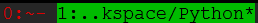
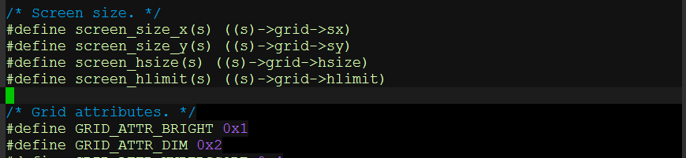
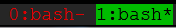
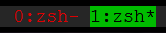

### 1. tmux panel title显示为路径名问题

自从习惯了使用zsh之后，便一直使用oh-my-zsh。再加上tmux，简直就是我等程序员
的利器啊，可是自从发现了在tmux的panel title显示为路径名之后，就一直感觉不
爽，如下：

虽然将tmux.conf中的default-terminal设置为xterm-256color能解决这个问题，
但是在tmux会话中打开vim时，显示一片灰一片黑还真令人受不了：

在重装了libevent库，重新编译了tmux后还是没有解决。换回bash后，显示又正常了：

经过不懈努力，终于定位到zshrc中的配置，将zshrc中DISABLE_AUTO_TITLE="true"
的注释去掉，问题成功解决，一切终于和谐了，洗洗睡吧！<^_\_^>

