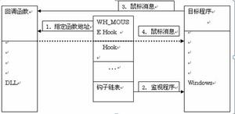

API Hook

### 钩子的简单原理

每一类HOOK都存放在一个指针列表中，称之为钩子链表，这些钩子链表由Windows系统来维护。
这个列表的指针指向指定的应用程序定义的，被HOOK子程调用的回调函数，也就是该钩子的各个处理子程。
当与指定的HOOK类型关联的消息发生时，系统就把这个消息传递到HOOK子程（回调函数）。
HOOK子程就可以监视消息，或者修改消息，或者停止消息的前进，避免这些消息传递到下一个HOOK子程或者目的窗口。
调用系统API的函数SetWindowsHookEx可以把HOOK子程设置到钩子链表中去。

##### 代码的injection

常用的方法有：

1.使用注册表HKLM/Software/Microsoft/Windows NT/CurrentVersion/Windows/AppInit_DLLs

> 这种方法可以指定多个DLL，用空格隔开。这些DLL会被任何用到User32.dll的所有程序自动加载。
当User32.dll加载的时候，User32.dll的DllMain会收到一个DLL_PROCESS_ATTACH通知，
User32在这个时候读取注册表项中的值，调用LoadLibrary加载各个DLL。显然使用这种方法要求
设置注册表之后立刻重起系统，不过一般情况下这不是大问题。这种方法的主要问题在于，只有用到
User32.dll的应用程序才会被Inject。所有的GUI和少部分CUI程序会用到User32.dll，所以
如果你的API Hook程序不打算监视CUI程序的话，那么可能问题并不太大。但是如果你的API Hook
程序需要监视系统中所有进程的话，这种方法的限制将是非常致命的。

2.调用SetWindowsHookEx(WH_GETMESSAGE, …, 0)

> 可以使用SetWindowsHookEx(WH_GETMESSAGE, …, 0) 设置全局的消息钩子，虽然可能你的程
> 序并不用到消息钩子，但是钩子的一个副作用是会将对应的DLL加载到所有的GUI线程之中。类似的，
> 只有用到GUI的进程才会被挂接。虽然有这种限制，这种方法仍然是最常用的挂接进程的方法。

3.使用CreateRemoteThread函数在目标进程中创建远程线程

> 这种方法可以在任意的目标进程中创建一个远程线程，远程线程中可以执行任意代码，
> 这样便可以做到把我们的代码Inject到目标进程中。这种方法具有最大的灵活性，
> 但是难度也最高：
> a) 远程线程代码必须可以自重定位
> b) 要能够监视进程的启动和结束，这样才可以挂接到所有进程

4.如果你只是要挂接某个特定进程的并且情况允许你自己来创建此进程，你可以调用CreateProcess(…, CREATE_SUSPENDED)创建子进程并暂停运行，然后修改入口代码使之调用LoadLibrary加载自己的DLL。该方法在不同CPU之间显然是无法移植的。

#### Hook API

常用的方法有：

1. 找到API函数在内存中的地址，改写函数头几个字节为JMP指令跳转到自己的代码，执行完毕再执行API开头几个字节的内容再跳回原地址。这种方法对CPU有较大的依赖性，而且在多线程环境下可能出问题，当改写函数代码的时候有可能此函数正在被执行，这样做可能导致程序出错。

2. 修改PE文件的IAT (Import Address Table)，使之指向自己的代码，这样EXE/DLL在调用系统API的时候便会调用你自己的函数

[Refefence Website](http://blog.csdn.net/atfield/article/details/1507122)
